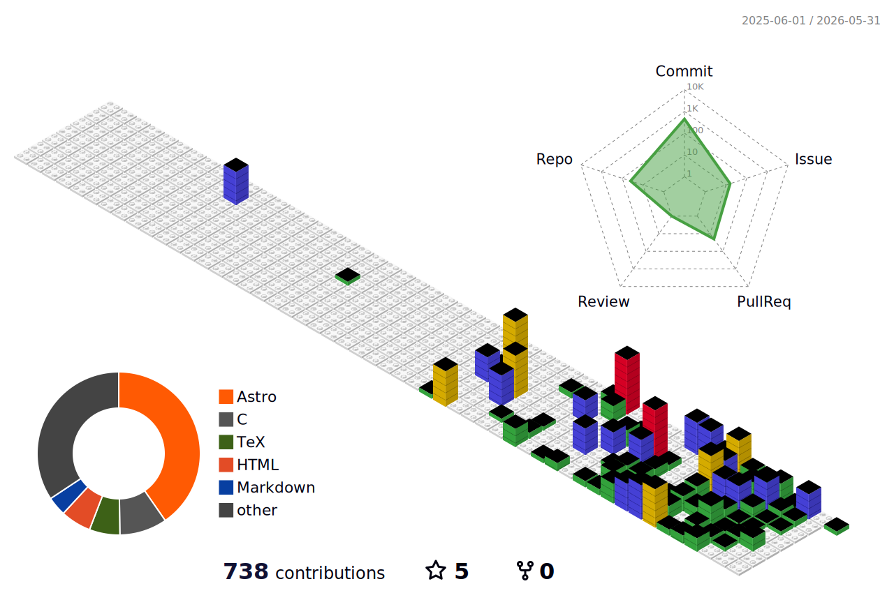

# Hi there 👋

## My Blog
[https://blog.kinghua0629.tech](https://blog.kinghua0629.tech)
## Github States

## Contribution Graph

<picture>
  <source media="(prefers-color-scheme: dark)" srcset="https://github.com/kinghua0629/kinghua0629/blob/output/github-contribution-grid-snake-dark.svg" />
  <source media="(prefers-color-scheme: light)" srcset="https://github.com/kinghua0629/kinghua0629/blob/output/github-contribution-grid-snake.svg" />
  
</picture>

<!--
**kinghua0629/kinghua0629** is a ✨ _special_ ✨ repository because its `README.md` (this file) appears on your GitHub profile.

Here are some ideas to get you started:

- 🔭 I’m currently working on ...
- 🌱 I’m currently learning ...
- 👯 I’m looking to collaborate on ...
- 🤔 I’m looking for help with ...
- 💬 Ask me about ...
- 📫 How to reach me: ...
- 😄 Pronouns: ...
- ⚡ Fun fact: ...
-->
